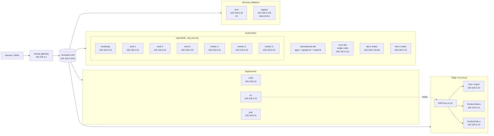

# Homelab Infrastructure Map

Cluster domain: `lab.virer.net`  
OpenShift console: <https://console-openshift-console.apps.lab-ocp.virer.net/>

## Inventory (Quick Reference)

### Core Network
- `nanopi` = `100.100.0.1`

### Hyperviseurs
- `z240` = `100.100.0.9` (was `118`)
- `rtx` = `100.100.0.10` (was `130`)
- `yolo` = `100.100.0.6`

### Reverse Proxy (HAProxy sur `rtx`)
- `lab-a endpoint` = `100.100.0.11`
- `lab-o endpoint` = `100.100.0.12`

### Services utilitaires
- `omv` = `100.100.0.18`  
  s3
- `registry` = `100.100.0.142`  
  quay proxy

### OpenShift (`lab.virer.net`)
- `bootstrap` = `100.100.0.19`
- `etcd-1` = `100.100.0.21`
- `etcd-2` = `100.100.0.22`
- `etcd-3` = `100.100.0.23`
- `worker-1` = `100.100.0.31`
- `worker-2` = `100.100.0.32`
- `worker-3` = `100.100.0.33`

### `lab-a`
- `bootstrap.lab-a` = `100.100.0.60`
- `etcd-1.lab-a` = `100.100.0.61`
- `worker-3.lab-a` = `100.100.0.66`

### `hcp-balvenie.lab`
- `*.apps.hcp-balvenie.lab` = `100.100.0.71`
- `*.apps.hcp-balvenie.lab` = `100.100.0.73`
- `api.hcp-balvenie.lab` = `100.100.0.80`
- `api-int.hcp-balvenie.lab` = `100.100.0.80`
- `metal-lb` = `100.100.0.80-99`

### `lab-o`
- `worker-3.lab-o` = `100.100.0.76`

### `sno1.lab`
- `api.sno1.lab` = `100.100.0.111`
- `api-int.sno1.lab` = `100.100.0.111`
- `*.apps.sno1.lab` = `100.100.0.111`
- `sno1.lab` = `100.100.0.111`